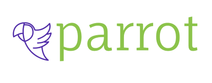

  

## 💻 Sobre o projeto

 
 Projeto desenvolvido durante o desafio Hands On 4 oferecido pela Gama Academy. 
- Este projeto apresenta um sistema white label, que seria uma rede social fornecida para que condominios incentivem a interação entre seus moradores.
 
Não foi possivel fazer o consumo de uma API, porque os alunos do back-end não conseguiram entregar a API.

---

## :mortar_board: Descrição das Funcionalidades

- Login
- Cadastro de usuário
- Perfil do usuário
- Feed
- Visita de Perfil
- Edição de dados do usuário

## 🛠 Tecnologias

As seguintes ferramentas foram usadas na construção do projeto:
  

  
  

<h2> 👨‍💻 Contribuidores </h2> 

<table align=center>
  <tr>
   <td align="center">  <a href="https://www.linkedin.com/in/eraldo-leonardo/"> Eraldo Leonardo </a>
   </td>
   <td align="center">  <a href="https://www.linkedin.com/in/ellen-ribeiro-7371811bb/"> Ellen Ribeiro</a>
   </td>
    <td align="center">  <a href="https://www.linkedin.com/in/jos%C3%A9-santos-68076015a/">José Pedro
</a>
   </td>
  </tr>
</table> </h2>

---
